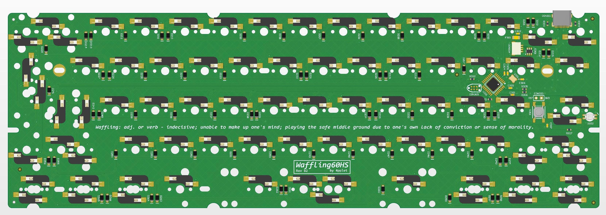

# waffling60

waffling60 is a multilayout 60% PCB with support for common ANSI and ISO layouts and split space. One version features hot swaps, one is a solder PCB. Hot swap board uses both north, south and 90-degree rotated switches, which might cause some compatibility issues with some keycaps.

## Status:
Tested and implemented in QMK and VIA main branches.

## Some features:
- QMK & VIA
- USB-C
- atmega32u2 in QFN and QFP
- RGB-led close to capslock
- Cherry PCB-stab support
- Split space
- ISO and ANSI
- On solder version: Switch rotation is only with LED facing south.
- **On hot swap version: Switch rotation is North, south and 90 degree, MAKE SURE TO CHECK SO THIS WILL NOT CAUSE KEYCAP ISSUES FOR YOU. Clip-in stabilziers is recommended for hot-swap version.**

## Layout support: 

## Altium view of PCB - Solder

## Altium view of - SE

## Altium view of - Hotswap

## Revisions:
- Rev A1: Initial prototype based on Steezy60 Alps-version.
- Rev A2: Rotate Fn-switch (split RShift) on solder version. Rotate LShift stabilizer on both versions. To rotate left shift stabilizer on hot-swap pcb, adjacent sockets is also rotated.
- Rev B1: Changed matrix and diode under capslock for cleaner routing and easier software implementation in QMK for LED
- Rev B2: Moved daughter board connector to allign all projects with a similar horisontal position and a identical vertical position. Removed flex-cuts for more preictable feel in "traditional" cases.
