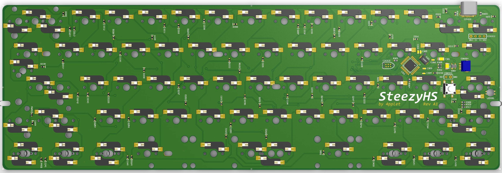

# SteezyHS

SteezyRGB is a multi layout hotswap 60% PCB with support for common ANSI and ISO layouts and split space.

## Status:
Not really started

## Some features:
- Hotswaps
- QMK
- USB-C
- atmega32u2 in QFN and QFP
- RGB-led close to capslock
- Cherry PCB-stab support
- Split space
- ISO and ANSI

## Altium view of PCB

## Layout support: 

## Revisions:
- Rev A1: Initial prototype based on Steezy60 Alps-version.