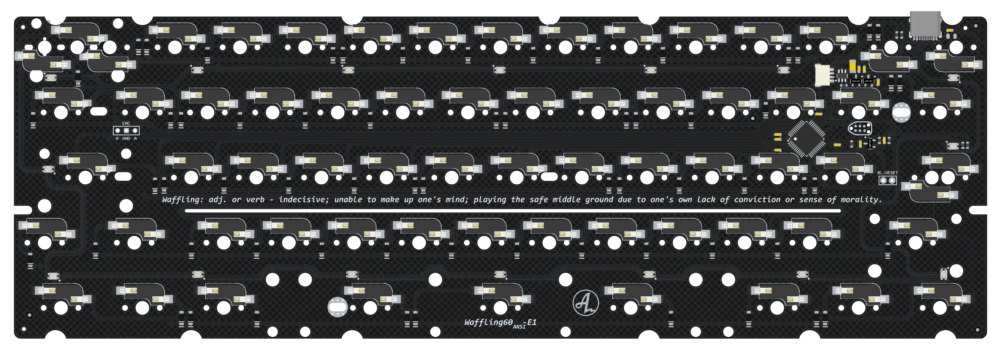

# waffling60

waffling60 is a multilayout 60% PCB with support for common ANSI and ISO layouts and split space. The PCB is split into different versions:
- ALPS tray mount version. Fit o-ring gummy worm if USB-port is not populated.
- MX tray mount version. Fit o-ring gummy worm if USB-port is not populated.
- MX Hot swap tray mount PCB in ISO layout. Fit o-ring gummy worm if USB-port is not populated.
- MX Hot swap tray mount PCB in ANSI layout. Fit o-ring gummy worm if USB-port is not populated.
- NMB Space Invader version. Fit o-ring gummy worm if USB-port is not populated.
- A dedicated version of the MX solder PCB to fit bakeneko/Kei cases. For use in Kei cases, a shorter or more flexible daughter board cable is recommended due to a slight different connector placement on PCB.
- A dedicated version of the MX solder PCB to fit ai03 Polaris V1.

Note: Waffling60 ISO HS Rev E is still being verified and added to QMK and VIA. At the moment, use revision D files for manufacturing. When tested and added, I'll change the releases from pre-release to release.

## Features:
- QMK & VIA
- USB-C
- RGB-led under to capslock-switch for non-hotswap and NMB versions. A transparent switch is needed to see the light from the LED through the switch.
- 16 underglow LEDs
- Cherry PCB-stab support
- Split space
- USB horizontal placement is classic GH60, same as GH60, plain60, voyager60 etc for the tray mount versions.
- SE-version is adapted for Polaris (stab-rotations, outline and USB-placement), make sure to order 1.2 mm thickness when manufacturing these.
- Rotary encoder support on top row, furthest to the right. Split backspace position. Only specific SMD encoders fit. Example further down.

## **Disclaimer/note:**
- **Important:** SE version of waffling60 (Polaris compatible version) are not officially endorsed by ai03 and ai03 takes no responsibility or offers any support for these if there is any issue. I have been given permission to open source and offer these for sale.**

## Availability:
As an option to DIY, I'll try and keep these available for purchase here: https://4pplet.com/ For DIY, the production files are avaliable in releases.

## Layout support MX: 

## MX Solder

## ALPS Solder

## SE ("Bolaris")

## DB (Daughterboard/"Bakeneko")

## NMB (NMB/Space Invaders)

## Layout support MX HS ISO: 

## MX Hot Swap ISO

## Layout support MX HS ANSI: 

## MX Hot Swap ANSI

## Deviations on NMB version due to switch/footprint constraints:
- Different x-axis JST position, further from the PCB center.
- No Rotary encoder on PCB
- No 6U support
- Different encoder header position for off PCB encoder
- Different JTAG tagconnect position

## Instructions for manufacturing.
All PCBs except for the SE-version ("Bolaris") can be assembled for use with a bakeneko-style case. Simply remove the USB-port from the BOM or de-select it/tell the manu not to assemble it. The process will vary depending on what manufacturer is used.

## For ordering:
The following files are needed for the PCB Fab:
- BOM (contains component specifications)
- Pick and Place (contains component placement data)
- Gerber (contains PCB drawings and drill files)

## Releases
Files for manufacturing can be found in releases: https://github.com/4pplet/waffling60/releases

## Revision naming scheme
- Revision: When updating the PCB I bump the revision. The revision is specified with a letter and a number. For big changes, the letter is changed (usually also include code changes), for minor changes, only the number is bumped.
- Version: Version specifies different switch types, PCB's specific to certain cases etc.

## Revision history:
- Rev A1: Initial prototype based on Steezy60 Alps-version.
- Rev A2: Rotate Fn-switch (split RShift) on solder version. Rotate LShift stabilizer on both versions. To rotate left shift stabilizer on hot-swap pcb, adjacent sockets is also rotated.
- Rev B1: Changed matrix and diode under capslock for cleaner routing and easier software implementation in QMK for LED
- Rev B2: Moved daughter board connector to allign all projects with a similar horisontal position and a identical vertical position. Removed flex-cuts for more preictable feel in "traditional" cases.
- Rev B3: Changed stab rotation to what's more common today. Alligns with most common projects and cases. Updated PCB outline. Moved daughter board connector for better position in bakeneko. Added flexcuts again, but a simpler one.
- Rev B4: Changes to PCB outline, added support for bakeneko V3 and possibly KEI
- Rev B5 - Alps: Adding symetrical split space support using AEK-keycaps and adding RGB led below capslock switch for use with transparent switches (matias)
- Rev C1: Revision adds 3u+1U+3U Split space and 10U space support.
- Rev D: Moves to APM32 MCU, minor changes to routing and USB shielding.
- Rev E1: Adds NMB version. Adds underglow, rotary encoder support and 6u space support. Changed the switch rotation on MX ISO-enter. Reset button removed to reduce risk of resetting the board when bottoming out or when using a lot of foam.
- Rev E2: Fixes missing underglow resistor on NMB PCB. Fixes incorrect 6u support on solder PCBs (all versions with 6u support).
- Rev E3 on Waffling60SE: Adds a missing 5-pin switch hole on bottom row.
- Rev E3 on Waffling60DB: Adjusting UDB connector to align with the rest of the project. It had a slight offset.

## Encoders:
The footprint for encoders is a fairly common one. It supports two versions of bottom pins. The one below is an example. Similar looking SMD encoders (pin placement and bottom pins) will likely fit.

Example of tested encoders:

Link: https://www.aliexpress.com/item/1005001265188249.html

<a href='https://ko-fi.com/4pplet' target='_blank'>
