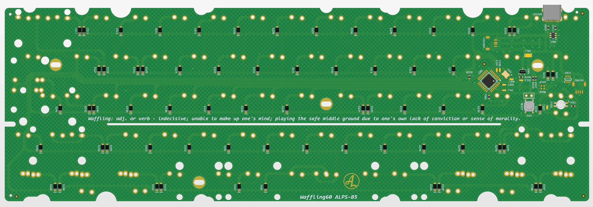

# waffling60

waffling60 is a multilayout 60% PCB with support for common ANSI and ISO layouts and split space. The PCB is split into different versions:
- One ALPS version with different assembly options.
- One MX version with different assembly options.
- One dedicated version of the MX PCB to fit bakeneko/Kei cases. For use in Kei cases, a shorter daughter board cable is recommended due to different connector placement on PCB.
- One dedicated version of the MX PCB made to fit ai03 Polaris.
- ISO Hot swap version with fixed layout. Revisions B2 and older is a multi layout hotswap. This was simplified in revision B3 to a fixed layout.

## Features:
- QMK & VIA
- USB-C
- ATmega32U2 in QFN and QFP
- RGB-led under/close to capslock for non-hotswap versions
- Cherry PCB-stab support
- Split space
- USB horizontal placement is classic GH60, same as GH60, plain60, voyager60 etc for the normal MX and ALPS-version
- SE-version is adapted for Polaris (stab-rotations, outline and USB-placement), make sure to order 1.2 mm thickness when manufacturing these.
- 10U support is for 10U Spacebars.

## **Disclaimer/note:**
- **Important:** SE version of waffling60 (Polaris compatible version) are not officially endorsed by ai03 and ai03 takes no responsibility or offers any support for these if there is any issue. I have been given permission to open source and offer these for sale.**

## Availability:
As an option to DIY, I'll try and keep these available for purchase here: https://4pplet.com/ For DIY, the production files are avaliable in releases.

## Layout support MX: 

## MX Solder, multiple assembly options

## ALPS Solder, multiple assembly options

## SE ("Bolaris")

## BK ("Bakeneko")

## Layout support MX HS: 

## MX Hot Swap ISO

## Instructions for manufacturing.

The regular solder versions of this project can be assembled in two different configurations:
1. Traditional tray mount with USB-C connector
2. Daughter board connector with no USB-C connector in bakeneko position

In most versions, a "all" configuration is also included, this is not a "one config fits all", it's intended to be used for making your own config. The special versions like bakeneko/polaris and hotswap have one assembly option.

## For ordering:
The following files are needed for the PCB Fab:
- BOM (contains component specifications)
- Pick and Place (contains component placement data)
- Gerber (contains PCB drawings and drill files)
- (optional) Assembly drawing, for manual assembly

Select the files for the desired configuration. Gerber and Pick and Place files will be the same for all three configurations, BUT!, you need to select the correct BOM for your configuration.

If you want to make a bakeneko compatible PCB, select the bakeneko BOM when ordering PCB's.

## Releases
Files for manufacturing can be found in releases.

Releases are split into the following versions of the PCB: (note: not the same as configuration)
- Waffling60 MX, a MX solder PCB in three configurations: Bakeneko, Tray
- Waffling60 Alps, a ALPS solder PCB in three configurations: Bakeneko, Tray and
- Waffling60 SE, a PCB compatible with AI03 Polaris, same layout support as the regular MX PCB. Order in 1.2mm thickness for use with the Polaris. Same flexcut and stab rotations as the OG PCB.
- Waffling60 BK, a dedicated bakeneko version of the regular MX PCB.

## For clarity
- Revision: When updating the PCB I bump the revision. The revision is specified with a letter and a number. For big changes, the letter is changed (usually also include code changes), for minor changes, only the number is bumped.
- Version: Version specifies different switch types, PCB's specific to certain cases etc.
- Configuration: Different assembly options for a specific version of waffling60 

## Revision history:
- Rev A1: Initial prototype based on Steezy60 Alps-version.
- Rev A2: Rotate Fn-switch (split RShift) on solder version. Rotate LShift stabilizer on both versions. To rotate left shift stabilizer on hot-swap pcb, adjacent sockets is also rotated.
- Rev B1: Changed matrix and diode under capslock for cleaner routing and easier software implementation in QMK for LED
- Rev B2: Moved daughter board connector to allign all projects with a similar horisontal position and a identical vertical position. Removed flex-cuts for more preictable feel in "traditional" cases.
- Rev B3: Changed stab rotation to what's more common today. Alligns with most common projects and cases. Updated PCB outline. Moved daughter board connector for better position in bakeneko. Added flexcuts again, but a simpler one.
- Rev B4: Changes to PCB outline, added support for bakeneko V3 and possibly KEI
- Rev B5 - Alps: Adding symetrical split space support using AEK-keycaps and adding RGB led below capslock switch for use with transparent switches (matias)
- Rev C1: Revision adds 3u+1U+3U Split space and 10U space support.

<a href='https://ko-fi.com/4pplet' target='_blank'>
